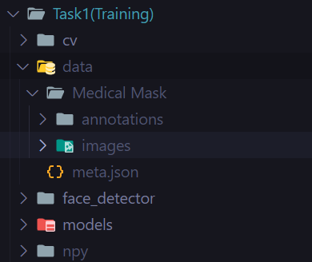

# Face Mask Detection with Face Tracking
Utitlized TensorFlow with OpenCV, utilizing MobileNetV2 for transfer learning to classify faces with or without masks. It employs a Caffe model for face detection and uses the KCF algorithm from OpenCV to track faces across video frames, optimizing performance by reducing the need for repeated face detection.

## Setup Environment
Run the DOCKERFILE to setup the jupyter lab\
OR\
Install the requirements in virtual environment
```bash
python3 -m venv .venv
pip install -r requirements
```
## Task 1: Training

### Preparing the Data Directory
place the Medical Mask directory containing the images directory inside the data directory such as:\


### If using docker copy the data to the container
```bash
docker cp data/ containerid:/Task1
```

### Check the notebooks
Run the Notebooks in the following order
1. notebook_eda.ipynb
2. notbook_training.ipynb
3. notebook_test.ipynb

## Task 2: Trying the Test Videos

### Run Face Detection on the provided Test Videos
```bash
python main.py
```
Videos will be generated inside the out directory inside Task2.\
The with_tracking directory videos were generated using KCF tracker.